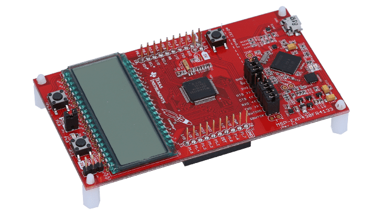

# MSP430FR4133-Board

Repositório dedicado aos testes práticos com o microcontrolador MSP430FR4133 LaunchPad, de Ultra Baixa Potência (ULP).

## Ambiente de Desenvolvimento

- Linux POP!_OS 22.04 LTS

- CCStudio IDE

- MSP430 ULP MSP430FR4133 MCU 16-bit RISC architecture

## Embedded Target

